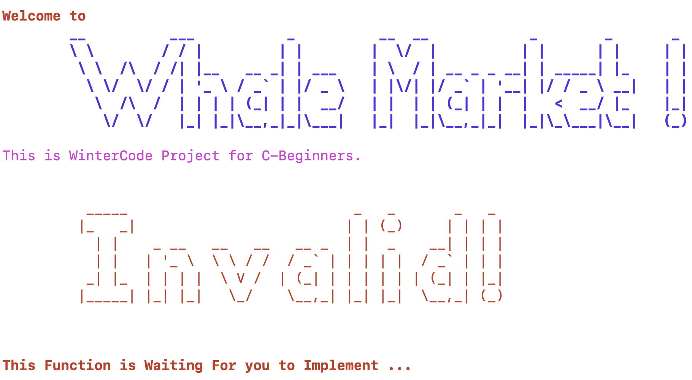

# 框架代码的说明

基本使用方法：

```shell
user@linux WhaleMarket> make # 或者 make main
```

一些过程信息

```shell
user@linux WhaleMarket> ./main
输出main函数运行结果
user@linux WhaleMarket> make clean # 清除项目生成过程中产生的中间文件和生成的可执行程序
```

编辑项目的方式：

```shell
user@linux WhaleMarket> code .
```

会弹出vscode窗口，在窗口下编辑文件即可

建议自主设计项目的文件结构，不要所有的代码都堆在一个文件里，
也不要所有的代码文件都堆在一个文件夹里。


## 正常构建项目需要遵守的约定

1. 在src文件夹下放源文件，在include文件夹下放头文件；
2. 包含头文件的路径名是从include文件夹开始的相对路径，可以看框架；
3. 文件IO的路径名是从WhaleMarket开始的相对路径；


## 环境测试

```shell
user@linux WhaleMarket> code . # 能够正常唤起vscode
user@linux WhaleMarket> make # 或者 make main
# 一些过程信息，没有报错信息
user@linux WhaleMarket> ./main
#得到下图中的结果并听到系统提示音
```




命令成功编译运行程序并获得图中的输出结果，听到系统提示音，则环境配置成功，
可以正式开始了。

